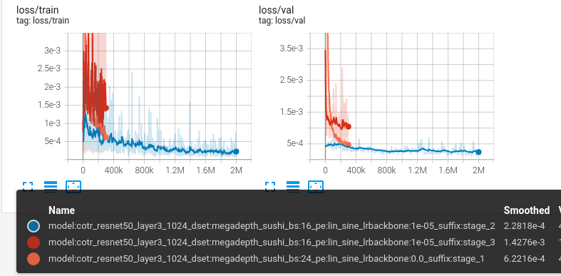
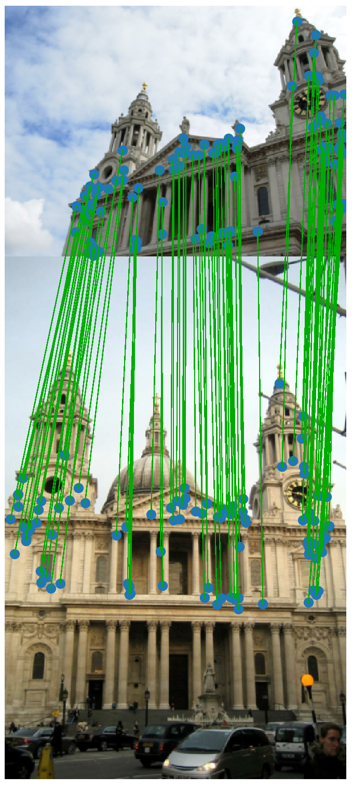
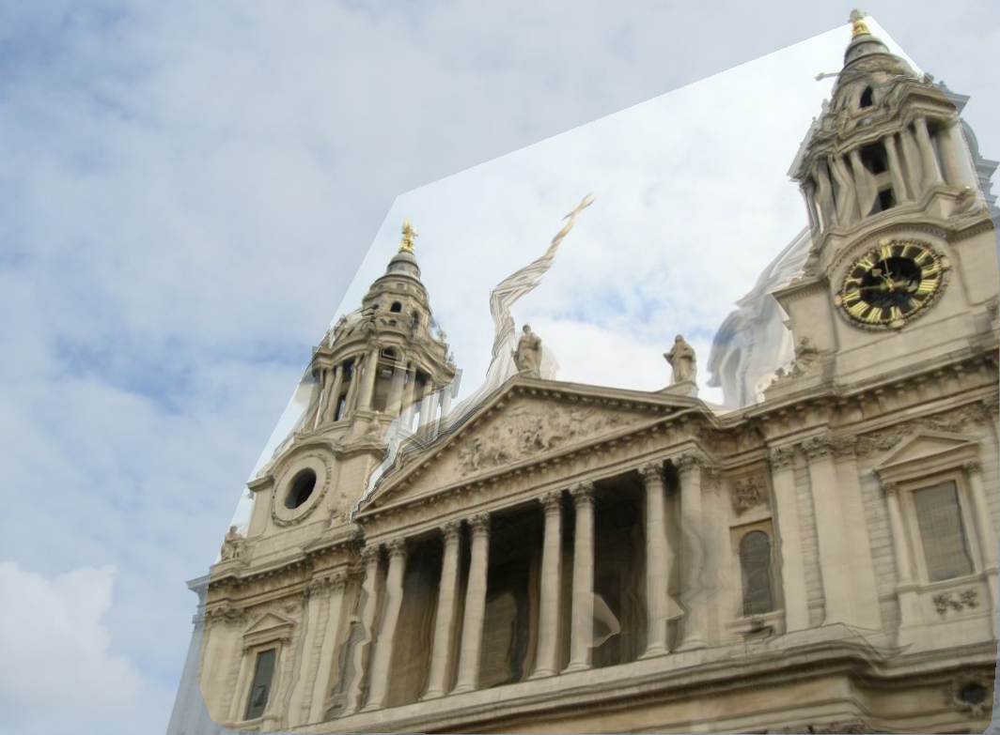
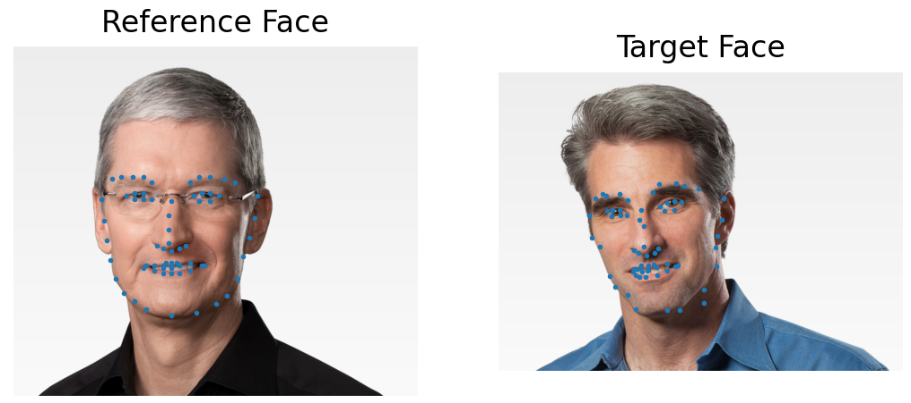
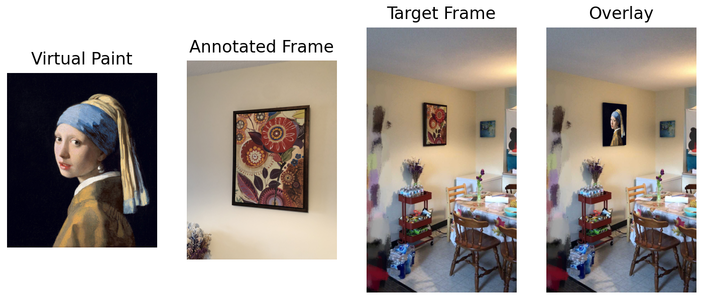
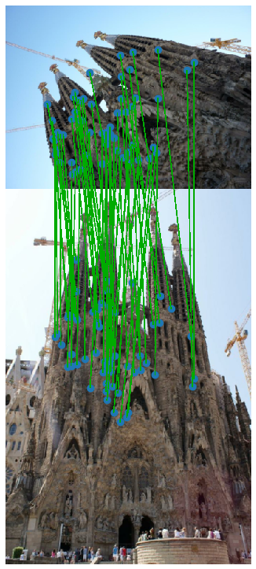
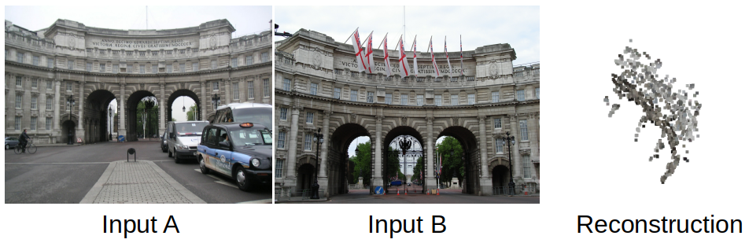
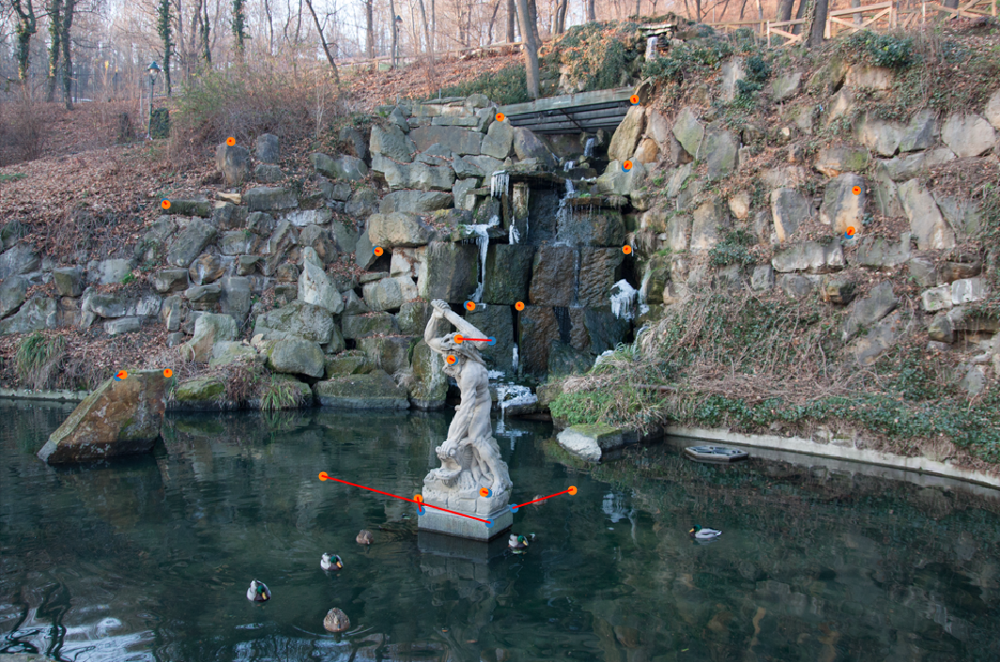

# COTR: Correspondence Transformer for Matching Across Images (ICCV 2021)

This repository is a reference implementation for COTR.
COTR establishes correspondence in a functional and end-to-end fashion. It solves dense and sparse correspondence problem in the same framework.

[[arXiv]](https://arxiv.org/abs/2103.14167), [[video]](https://jiangwei221.github.io/vids/cotr/README.html), [[presentation]](https://youtu.be/bOZ12kgfn3E), [[pretrained_weights]](https://www.cs.ubc.ca/research/kmyi_data/files/2021/cotr/default.zip), [[distance_matrix]](https://www.cs.ubc.ca/research/kmyi_data/files/2021/cotr/MegaDepth_v1.zip)

##  Training

### 1. Prepare data

See `prepare_data.md`.

### 2. Setup configuration json

Add an entry inside `COTR/global_configs/dataset_config.json`, make sure it is correct on your system. In the provided `dataset_config.json`, we have different configurations for different clusters.

Explanations on some json parameters:

`valid_list_json`: The valid list json file, see `2. Valid list` in `Scripts to generate dataset`.

`train_json/val_json/test_json`:  The splits json files, see  `3. Train/val/test split` in `Scripts to generate dataset`.

`scene_dir`: Path to Megadepth SfM folder(rectified ones!). `{0}{1}` are scene and sequence id used by f-string.

`image_dir/depth_dir`: Path to images and depth maps of Megadepth.

### 3. Example command

```python train_cotr.py --scene_file sample_data/jsons/debug_megadepth.json  --dataset_name=megadepth --info_level=rgbd --use_ram=no --batch_size=2 --lr_backbone=1e-4 --max_iter=200 --valid_iter=10 --workers=4 --confirm=no```

**Important arguments:**

`use_ram`: Set to "yes" to load data into maim memory.

`crop_cam`: How to crop the image, it will change the camera intrinsic accordingly.

`scene_file`: The sequence control file.

`suffix`: Give the model a unique suffix.

`load_weights`: Load a pretrained weights, only need the model name, it will automatically find the folder with the same name under the output folder, and load the "checkpoint.pth.tar".

### 4. Our training commands

As stated in the paper, we have 3 training stages. The machine we used has 1 RTX 3090, i7-10700, and 128G RAM. We store the training data inside the main memory during the first two stages.

Stage 1: `python train_cotr.py --scene_file sample_data/jsons/200_megadepth.json --info_level=rgbd --use_ram=yes --use_cc=no --batch_size=24 --learning_rate=1e-4 --lr_backbone=0 --max_iter=300000 --workers=8 --cycle_consis=yes --bidirectional=yes --position_embedding=lin_sine --layer=layer3 --confirm=no --dataset_name=megadepth_sushi --suffix=stage_1 --valid_iter=1000 --enable_zoom=no --crop_cam=crop_center_and_resize --out_dir=./out/cotr`

Stage 2: `python train_cotr.py --scene_file sample_data/jsons/200_megadepth.json --info_level=rgbd --use_ram=yes --use_cc=no --batch_size=16 --learning_rate=1e-4 --lr_backbone=1e-5 --max_iter=2000000 --workers=8 --cycle_consis=yes --bidirectional=yes --position_embedding=lin_sine --layer=layer3 --confirm=no --dataset_name=megadepth_sushi --suffix=stage_2 --valid_iter=10000 --enable_zoom=no --crop_cam=crop_center_and_resize --out_dir=./out/cotr --load_weights=model:cotr_resnet50_layer3_1024_dset:megadepth_sushi_bs:24_pe:lin_sine_lrbackbone:0.0_suffix:stage_1`

Stage 3: `python train_cotr.py --scene_file sample_data/jsons/200_megadepth.json --info_level=rgbd --use_ram=no --use_cc=no --batch_size=16 --learning_rate=1e-4 --lr_backbone=1e-5 --max_iter=300000 --workers=8 --cycle_consis=yes --bidirectional=yes --position_embedding=lin_sine --layer=layer3 --confirm=no --dataset_name=megadepth_sushi --suffix=stage_3 --valid_iter=2000 --enable_zoom=yes --crop_cam=no_crop --out_dir=./out/cotr --load_weights=model:cotr_resnet50_layer3_1024_dset:megadepth_sushi_bs:16_pe:lin_sine_lrbackbone:1e-05_suffix:stage_2`

<p align="center">
  
</p>

## Demos

Check out our demo video at [here](https://jiangwei221.github.io/vids/cotr/README.html).

### 1. Install environment

Our implementation is based on PyTorch. Install the conda environment by: `conda env create -f environment.yml`.

Activate the environment by: `conda activate cotr_env`.


### 2. Download the pretrained weights

Download the pretrained weights at [here](https://www.cs.ubc.ca/research/kmyi_data/files/2021/cotr/default.zip). Extract in to `./out`, such that the weights file is at `/out/default/checkpoint.pth.tar`.

### 3. Single image pair demo

```python demo_single_pair.py --load_weights="default"```

Example sparse output:

<p align="center">
  
</p>

Example dense output with triangulation:

<p align="center">
  
</p>

**Note:** This example uses 10K valid sparse correspondences to densify.

### 4. Facial landmarks demo

`python demo_face.py --load_weights="default"`

Example:

<p align="center">
  
</p>

### 5. Homography demo

`python demo_homography.py --load_weights="default"`

<p align="center">
  
</p>

### 6. Guided matching demo

`python demo_guided_matching.py --load_weights="default"`

<p align="center">
  
</p>

### 7. Two view reconstruction demo

Note: this demo uses both known camera intrinsic and extrinsic.
`python demo_reconstruction.py --load_weights="default" --max_corrs=2048 --faster_infer=yes`

<p align="center">
  
</p>

### 8. Annotation suggestions

If the annotator knows the scale difference of two buildings, then COTR can skip the scale estimation step.
`python demo_wbs.py --load_weights="default"`

<p align="center">
  
</p>


## Faster Inference

We added a faster inference engine.
The idea is that for each network invocation, we want to solve more queries. We search for nearby queries and group them on the fly.
*Note: Faster inference engine has slightly worse spatial accuracy.*
Guided matching demo now supports faster inference.
The time consumption for default inference engine is ~216s, and the time consumption for faster inference engine is ~79s, on 1080Ti.
Try `python demo_guided_matching.py --load_weights="default" --faster_infer=yes`.

## Citation

If you use this code in your research, please cite our paper:

```
@inproceedings{jiang2021cotr,
  title={{COTR: Correspondence Transformer for Matching Across Images}},
  author={Wei Jiang and Eduard Trulls and Jan Hosang and Andrea Tagliasacchi and Kwang Moo Yi},
  booktitle=ICCV,
  year={2021}
}
```
